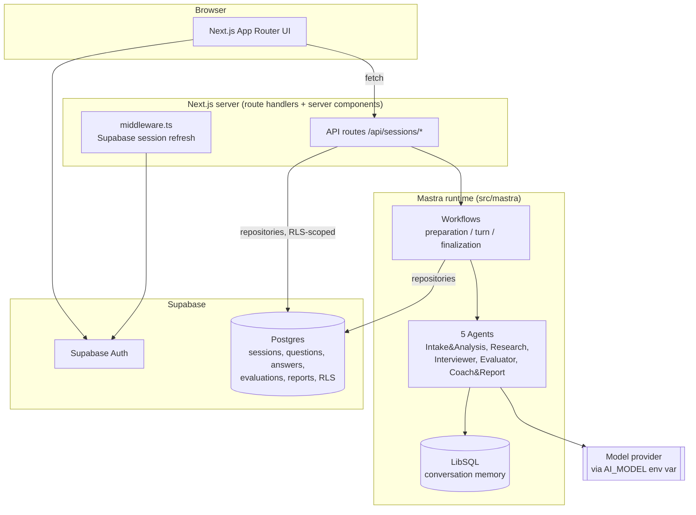
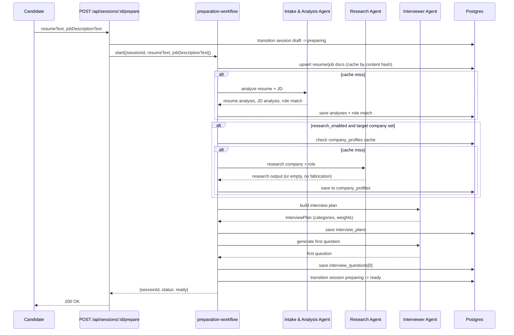
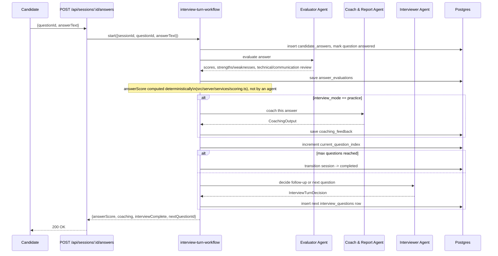
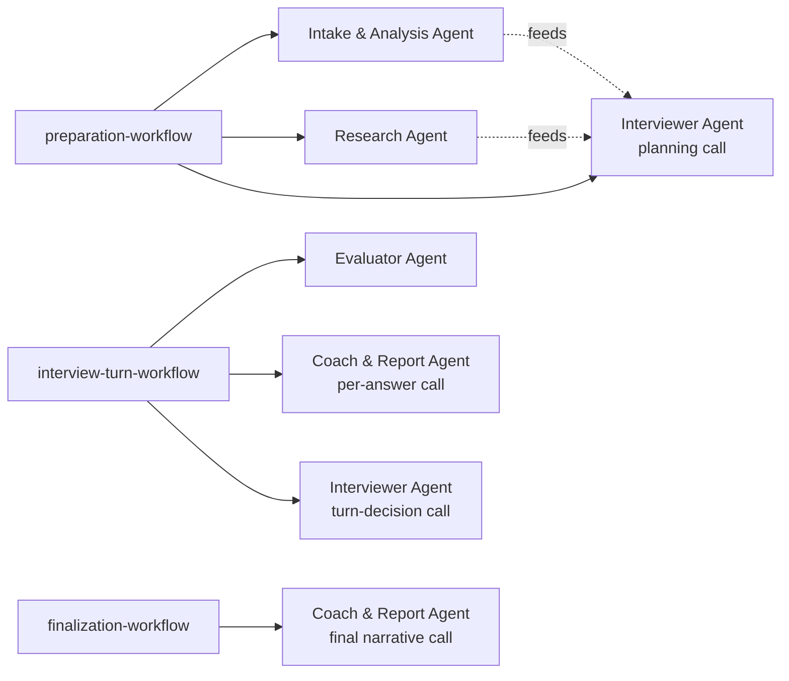
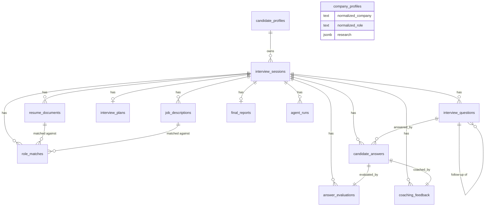

# Architecture

## System architecture

## Preparation workflow

## Interview-turn workflow

## Agent call graph

There is no LLM orchestrator/router. Each workflow calls a fixed sequence of
agents directly — see [AGENTS.md](./AGENTS.md#delegation-model) for why an
agent network was deliberately not used here.

## Database relationships

`company_profiles` is intentionally not connected to `interview_sessions` —
it's a shared cache keyed by normalized company/role, not owned by any one
session, so multiple candidates researching the same company reuse it.
